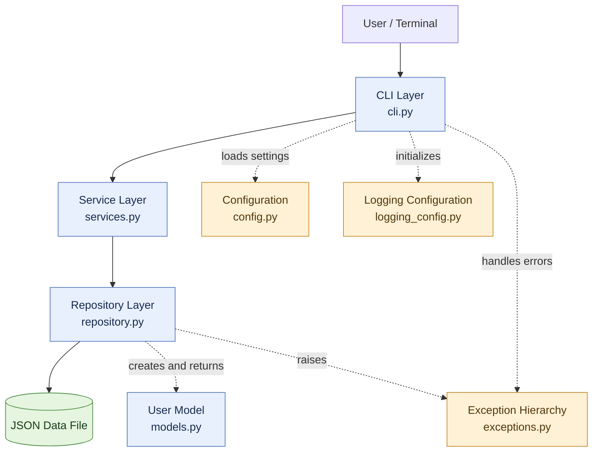
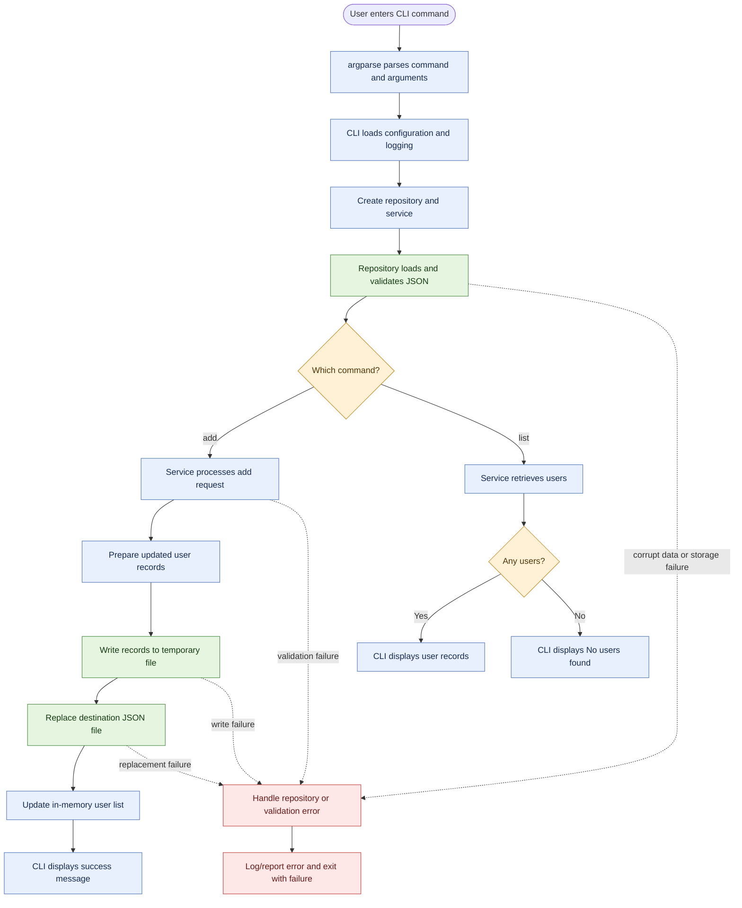
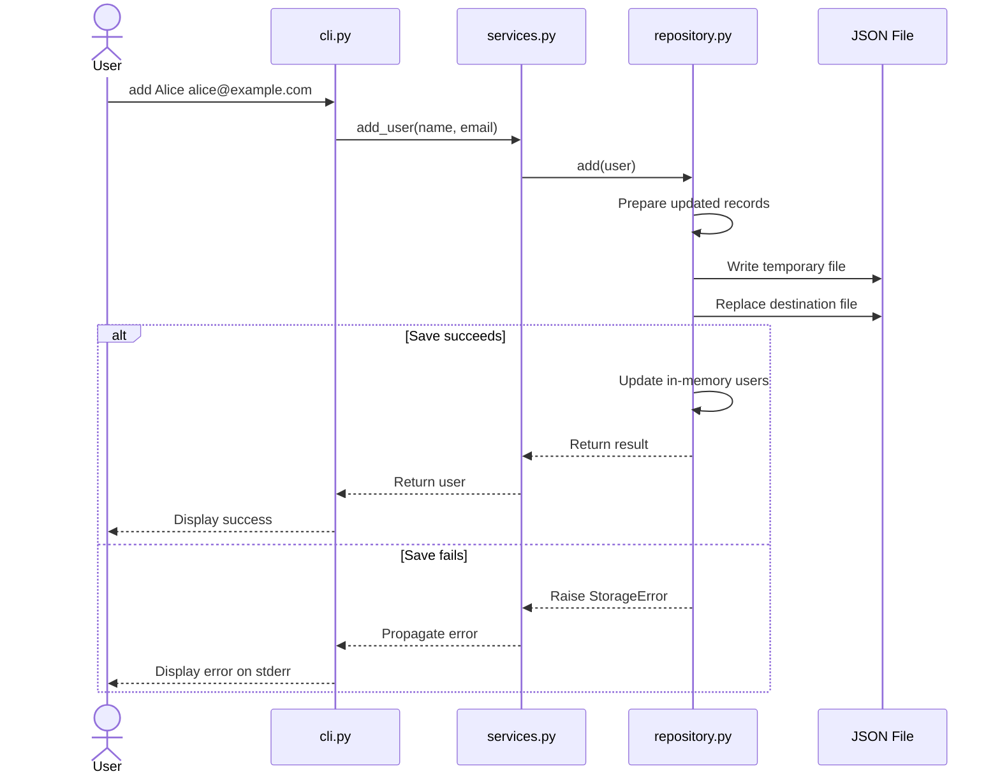

# User Registry CLI

A command-line application for managing user records with Python, JSON-based persistence, layered architecture, explicit error handling, logging, and automated tests.

The project started as a simple user registration tool and evolved into a more robust application by introducing separation of concerns, configuration management, test isolation, and safer file persistence.

## Table of Contents

- [Project Overview](#project-overview)
- [Features](#features)
- [Technology Stack](#technology-stack)
- [Architecture](#architecture)
- [Project Structure](#project-structure)
- [Application Data Flow](#application-data-flow)
- [User Interaction](#user-interaction)
- [Data Storage](#data-storage)
- [Error Handling and Logging](#error-handling-and-logging)
- [Testing Strategy](#testing-strategy)
- [Engineering Improvements](#engineering-improvements)
- [What I Learned](#what-i-learned)
- [Known Limitations](#known-limitations)
- [Future Improvements](#future-improvements)

## Project Overview

User Registry is a Python CLI application that allows users to add and list user records.

Each user has two fields:

- `name`
- `email`

The application stores user records in a JSON file and loads them when the repository is initialized.

The main objective of the project was not just to implement CRUD-style functionality, but to understand how to organize a Python application so that its logic, storage, configuration, logging, and user interaction remain separate and testable.

## Features

- Add a user through the command line.
- List registered users.
- Store user records in a local JSON file.
- Represent users using an immutable Python dataclass.
- Validate the structure and types of persisted JSON records.
- Handle malformed JSON and invalid stored data.
- Translate filesystem failures into application-specific exceptions.
- Write changes through a temporary file before replacing the original.
- Preserve in-memory state when a save fails.
- Use centralized configuration and logging.
- Write automated tests using pytest and temporary test directories.

## Technology Stack

| Technology | Purpose |
|---|---|
| Python | Application implementation |
| `argparse` | Command-line argument parsing |
| `dataclasses` | User data model |
| `json` | Serialization and deserialization |
| `pathlib` | Filesystem path management |
| `tempfile` | Temporary files for persistence |
| `logging` | Diagnostic information and error reporting |
| `pytest` | Automated testing |
| `monkeypatch` | Simulating failures in tests |
| Git and GitHub | Version control and source hosting |

## Architecture

The application uses a layered design. Each component has a specific responsibility, which reduces coupling and makes the application easier to test and maintain.

### 1. CLI Layer — `cli.py`

The CLI is the entry point of the application.

Responsibilities:

- Parse commands and arguments using `argparse`.
- Initialize configuration and logging.
- Create the repository and service objects.
- Invoke the appropriate service operation.
- Display successful results to the user.
- Display errors on standard error and return a nonzero exit status for handled failures.

The CLI supports the `add` and `list` commands.

It does not directly implement JSON persistence. That responsibility belongs to the repository.

### 2. Service Layer — `services.py`

The service layer coordinates application operations between the CLI and the repository.

The CLI calls service methods instead of directly manipulating stored records.

This separation provides a place for application-level rules and validation without mixing them with command-line parsing or filesystem operations.

### 3. Repository Layer — `repository.py`

The repository manages JSON persistence and the in-memory collection of `User` objects.

Its responsibilities include:

- Loading existing user records.
- Validating persisted JSON structure and field types.
- Converting records into `User` objects.
- Preparing data for serialization.
- Writing changes to a temporary file.
- Replacing the original file after a successful write.
- Translating storage and corruption failures into meaningful exceptions.

The repository updates its in-memory list only after persistence succeeds.

### 4. Model Layer — `models.py`

The `User` model is defined using a frozen dataclass.

```python
from dataclasses import dataclass

@dataclass(frozen=True)
class User:
    name: str
    email: str
```

The model provides a clear representation of a user and prevents normal reassignment of its fields after construction.

### 5. Exception Layer — `exceptions.py`

The application defines a hierarchy of custom exceptions:

- `UserRegistryError`: base application exception.
- `RepositoryError`: base class for storage and retrieval errors.
- `DataCorruptionError`: invalid JSON or invalid stored record structure.
- `StorageError`: filesystem or persistence failure.

This hierarchy allows the CLI to catch repository-related failures without handling every low-level exception separately.

### 6. Configuration and Logging

The configuration module provides application settings, including the data-file path.

The logging configuration is initialized centrally by the CLI. Diagnostic errors can be recorded through Python's logging framework, while user-facing output is printed separately.

This separation helps distinguish application diagnostics from normal CLI output.



## Project Structure

The main source and test files are organized as follows:

```text
user_registery/
├── src/
│   └── user_registry/
│       ├── __init__.py
│       ├── cli.py
│       ├── config.py
│       ├── exceptions.py
│       ├── logging_config.py
│       ├── models.py
│       ├── repository.py
│       └── services.py
├── tests/
│   ├── test_repository.py
│   └── ...
├── README.md
└── pyproject.toml
```

The exact test filenames depend on the current repository contents. The source tree separates application code from tests.

## Application Data Flow

### Adding a user

The normal flow for adding a user is:

1. The user runs the CLI with the `add` command.
2. `argparse` parses the supplied name and email.
3. The CLI initializes configuration, logging, repository, and service objects.
4. The service handles the add operation.
5. The repository prepares a new list containing the existing users and the new user.
6. The repository serializes the list to a temporary file.
7. After the write succeeds, the temporary file replaces the target JSON file.
8. Only after persistence succeeds does the repository append the user to its in-memory collection.
9. The CLI displays a success message.

If a handled validation, corruption, or storage error occurs, the application reports the failure instead of treating it as a successful operation.

### Listing users

1. The user runs the CLI with the `list` command.
2. The CLI initializes the application components.
3. The repository loads and validates the stored JSON when initialized.
4. The service requests the registered users.
5. The CLI displays each user's name and email.
6. If no users exist, the CLI displays `No users found.`

The repository returns a new list from `list_all()`, so callers do not receive the repository's internal list object directly.



## User Interaction

### Add a user

```bash
python -m user_registry.cli add Alice alice@example.com
```

Expected successful output:

```text
User created:
Alice <alice@example.com>
```



### List users

```bash
python -m user_registry.cli list
```

Example output:

```text
Alice <alice@example.com>
Bob <bob@example.com>
```

If the registry is empty:

```text
No users found.
```

### Display help

```bash
python -m user_registry.cli --help
```

The exact commands for installing the project and running it from a fresh environment depend on the current `pyproject.toml` configuration.

## Data Storage

User records are persisted as a JSON array.

Example:

```json
[
  {
    "name": "Alice",
    "email": "alice@example.com"
  },
  {
    "name": "Bob",
    "email": "bob@example.com"
  }
]
```

### Loading data

When the repository starts:

- A missing data file is treated as an empty registry.
- Existing JSON is parsed.
- The root element must be a list.
- Each record must be a dictionary containing `name` and `email`.
- Both required values must be strings.
- Valid records are converted into `User` objects.

Malformed JSON and invalid record structures raise `DataCorruptionError`. Filesystem failures are translated into `StorageError`.

### Saving data safely

The repository uses a temporary file in the same directory as the destination file.

The save operation follows this sequence:

1. Create a uniquely named temporary file.
2. Serialize the proposed user records.
3. Close the temporary file.
4. Replace the destination file with the temporary file.
5. Update the in-memory list only after the save succeeds.

If an `OSError` occurs during writing or replacement, the repository attempts to remove the temporary file and raises `StorageError`, preserving the original exception as its cause.

This approach helps protect the original file from being replaced by an incomplete write. It does not provide full transactional or concurrency guarantees.

## Error Handling and Logging

The project distinguishes between different failure categories rather than treating every problem as a generic error.

| Failure | Handling |
|---|---|
| Malformed JSON | `DataCorruptionError` |
| Invalid root structure | `DataCorruptionError` |
| Missing required fields | `DataCorruptionError` |
| Invalid field types | `DataCorruptionError` |
| Filesystem read or write failure | `StorageError` |
| Invalid user input rejected by the service | Validation error handled by the CLI |
| Failed temporary-file replacement | `StorageError`, with the original cause preserved |

The CLI catches repository errors, logs diagnostic information, writes a user-facing error to standard error, and exits with a nonzero status.

This makes failures easier to diagnose and prevents normal output from being mixed with error messages.

## Testing Strategy

The project uses pytest to verify expected behavior and important failure scenarios.

Repository tests use `tmp_path` to create isolated filesystem locations. This prevents tests from modifying the real application data file.

### Data-loading tests

- A missing file produces an empty registry.
- Malformed JSON raises `DataCorruptionError`.
- A root JSON object instead of a list is rejected.
- Records with invalid field types are rejected.
- Records missing required keys are rejected.
- Non-dictionary records are rejected.
- Attempting to load a directory as the data file raises `StorageError`.

### Persistence failure tests

- A simulated partial-write failure raises `StorageError`.
- The original file remains unchanged after the simulated partial-write failure.
- Temporary files are cleaned up after the failure.
- A simulated file-replacement failure raises `StorageError`.
- Failed persistence does not update the repository's in-memory collection.
- The original file remains unchanged when replacement fails.

The test suite previously showed **16 passed** in the local pytest output. That result records the state at the time of the run; rerun the suite after any subsequent changes.

Run the tests with:

```bash
pytest -v
```

## Engineering Improvements

The project evolved beyond a basic script through several engineering improvements.

### 1. Separation of concerns

**Earlier approach:** Application operations could become mixed with command-line handling and storage code.

**Improvement:** The CLI, service, repository, model, and exception responsibilities are separated.

**Benefit:** Individual components can be changed and tested with less impact on the rest of the application.

### 2. Explicit dependency management

The CLI creates the repository and passes it to the service instead of requiring the service to create its own storage dependency.

**Benefit:** Dependencies are visible, and tests can substitute controlled implementations when needed.

### 3. Immutable user model

The `User` dataclass is frozen.

**Benefit:** Normal field reassignment is prevented, reducing accidental mutation of user records.

### 4. Structured error handling

The application uses custom exceptions to distinguish data corruption from storage failures.

**Benefit:** Callers can respond to different classes of errors appropriately, while the original exception can remain available for debugging.

### 5. Safer file persistence

The repository writes to a temporary file before replacing the original.

**Benefit:** It reduces the risk of destroying the previous file contents when a write fails before replacement.

### 6. In-memory consistency

The repository prepares the new data, persists it, and only then changes its in-memory collection.

**Benefit:** A failed save does not incorrectly make the current repository instance appear to have successfully stored the new user.

### 7. Failure-oriented testing

The tests simulate write and replacement failures rather than checking only successful operations.

**Benefit:** They verify behavior under realistic failure conditions, including preservation of existing data and temporary-file cleanup.

### 8. Centralized configuration and logging

Configuration and logging setup are kept outside the repository's core persistence logic.

**Benefit:** Environment-specific settings and diagnostic behavior can be managed without embedding them throughout the application.

## What I Learned

### Python engineering

- Building immutable data models with dataclasses.
- Using type hints and clear interfaces.
- Organizing Python applications into modules and layers.
- Working with `pathlib`, JSON serialization, and temporary files.
- Designing custom exception hierarchies.

### Software design

- Applying separation of concerns.
- Using dependency injection to make components easier to test.
- Keeping CLI behavior separate from application and persistence logic.
- Returning controlled copies of internal collections instead of exposing the internal list directly.

### Error handling and reliability

- Distinguishing corrupted data from storage failures.
- Preserving exception causes with exception chaining.
- Understanding why a failed save must not update in-memory state.
- Using temporary-file replacement to reduce the risk of partial writes.
- Understanding the difference between atomic replacement and concurrency control.

### Testing

- Writing isolated filesystem tests with pytest's `tmp_path`.
- Using `monkeypatch` to simulate failures.
- Testing failure behavior, not only successful execution.
- Checking that existing data and in-memory state remain unchanged after a failed save.

### Production-minded thinking

- Documenting known limitations rather than making unsupported reliability claims.
- Understanding why multiple writers can cause lost updates.
- Recognizing when a local JSON file is no longer an appropriate storage solution.
- Identifying when a database and transaction-based persistence would be more suitable.

## Known Limitations

### JSON storage

The application stores the complete registry in one local JSON file. This is simple and appropriate for a small learning project, but it is not a substitute for a database.

### Concurrent writers

The repository does not implement cross-process file locking or transactional concurrency control.

If two repository instances load the same file and save changes concurrently, one can overwrite the other's changes. Atomic file replacement does not prevent this lost-update problem.

**Operational constraint:** Use one writer at a time. Concurrent writes to the same data file are unsupported.

### Durability guarantees

Temporary-file replacement helps protect against incomplete writes, but the implementation does not establish a full crash-durability guarantee for every filesystem, operating system, or hardware failure.

### Data validation scope

The repository validates the JSON structure and the types of required fields. That alone does not establish that names and email addresses satisfy every business rule. Those rules must be enforced by the service layer where required.

### Scale

The repository loads all users into memory and rewrites the registry when a user is added. This approach becomes less efficient as the number of records grows.

## Future Improvements

Potential next steps include:

- Add duplicate-user checks and more comprehensive business validation.
- Expand CLI and service tests for success and failure cases.
- Improve documentation for installation, configuration, and execution.
- Add a safe concurrency strategy if multi-process access becomes a requirement.
- Migrate persistence to SQLite for a small database-backed application.
- Explore PostgreSQL, transactions, and concurrency control for a multi-user service.
- Add continuous integration to run the test suite automatically on changes.
- Add packaging and distribution checks for installation in a clean environment.

## Conclusion

The User Registry project demonstrates how a small Python CLI application can be developed with clearer architecture, explicit dependencies, structured error handling, safer persistence, and automated tests.

The main outcome is not just a working user registration tool. It is a practical understanding of how application layers interact, how persistence failures should be handled, how to test failure scenarios, and how to document the boundaries of a system honestly.